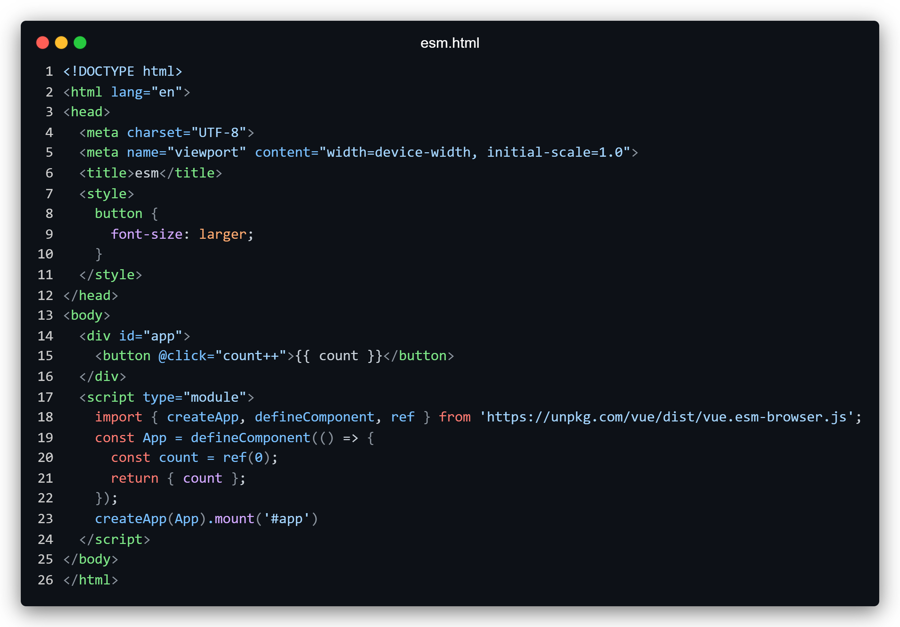
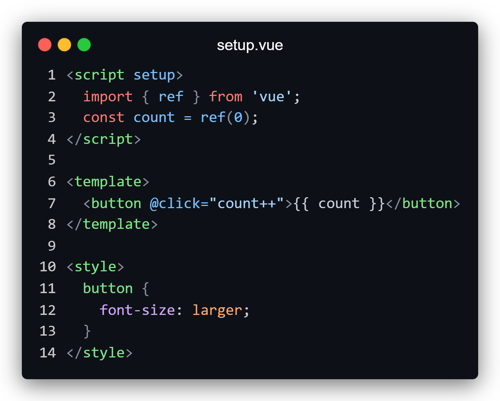
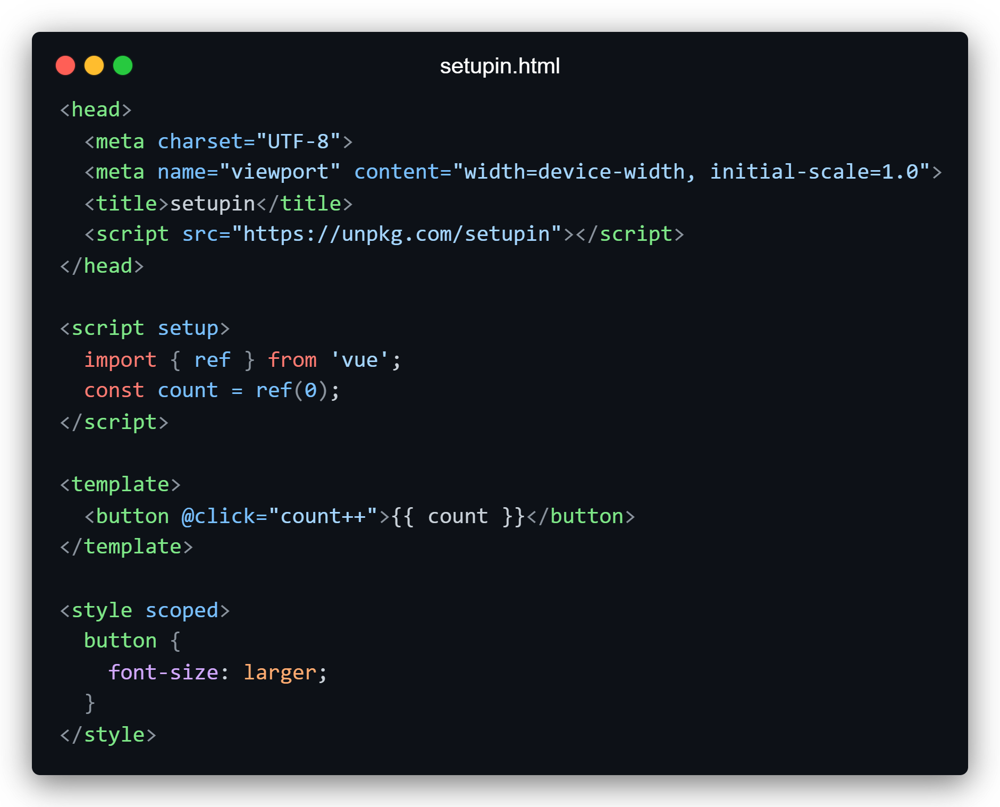

<p align="right">
  <b>English</b> | <a href="./README.zh-CN.md">简体中文</a>
</p>

<p align="center"></p>

<p align="center">
  <a href="https://stackblitz.com/edit/setupin"></a>
  <a href="https://npmjs.com/package/setupin"></a>
  <a href="https://bundlephobia.com/package/setupin"></a>
</p>

## 😏 What is a setupin?

**setupin** allows you to write Vue's [\<script **setup**\>](https://vuejs.org/api/sfc-script-setup.html)**in** HTML.

Using the [vue/compiler-sfc](https://github.com/vuejs/core/tree/main/packages/compiler-sfc#readme), which compiled at runtime for esm vue code format, and dynamic execution.

## 🤯 Code comparison





Consistent with \<script setup> except \<head>

## 🤓 Characteristics

- [x] [top-level await](https://vuejs.org/api/sfc-script-setup.html#top-level-await)
- [x] [sfc css features](https://vuejs.org/api/sfc-css-features.html)
- [x] vue3 macro functions
- [ ] [组件](https://vuejs.org/guide/essentials/component-basics.html)

## 🤔 Why setupin

1. **Easy to learn**
  Offer a friendly environment for beginners to easily grasp the core usage of Vue.
2. **Simple development**
  Provide a convenient way to rapidly develop small webpage without complex configurations.
3. **Quick experience**
  Allow users to quickly experiment with Vue's new features in HTML and feel its charm.

## 😝 Playground

try it on
[stackblitz](https://stackblitz.com/edit/setupin?file=index.html)
!

## 🥰 Usage

```html
<!-- The default is the dev version -->
<script src="https://unpkg.com/setupin"></script>

<!-- dev -->
<script src="https://unpkg.com/setupin/dist/main.js"></script>

<!-- prod -->
<script src="https://unpkg.com/setupin/dist/main.prod.js"></script>
```
